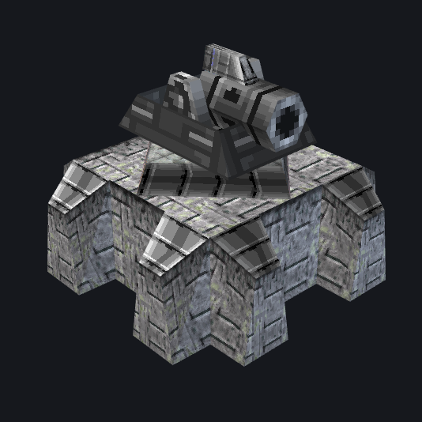
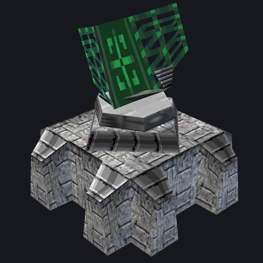
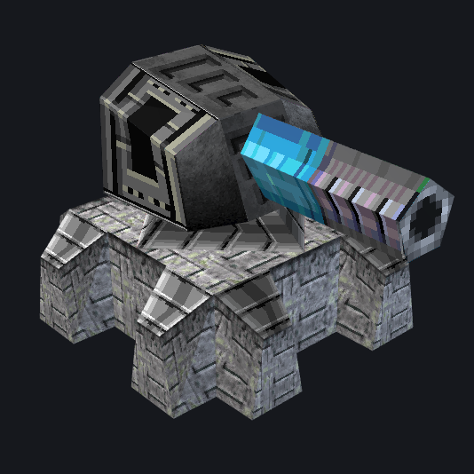
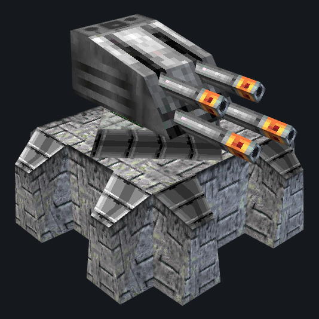
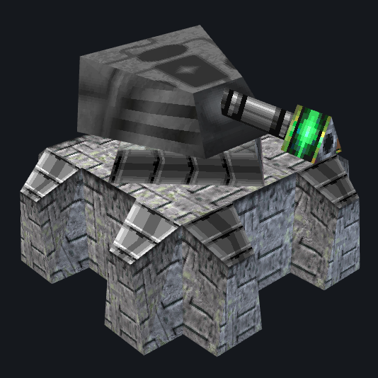
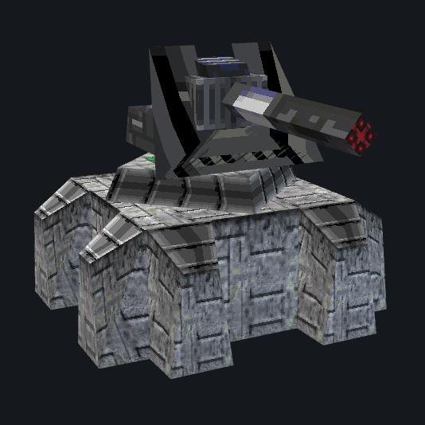

**Warzone 2100 Mod: More Fortress**

Adds 13 new Fortress defenses, 1 large wall, 1 ATGM emplacement, and 1 new tank weapon to skirmish and multiplayer.

## Installation

1. Copy this folder (or its `.wz` pack) into your Warzone 2100 mods folder:
   `mods/<version>/multiplay`
2. Enable the mod when hosting a multiplay or skirmish game.

## New structures

All fortresses join onto walls and come with their own gun. Most are 2x2;
the 3x3 Cannon Fortress is the exception. The Large Wall is a gunless 2x2 block.

MRT = Minimum Research Time from `research_time.py` (clean No Bases start,
1 fully-moduled lab, power cost ignored).

Assault Gun Fortress:

- List of Required Researches:
  - Assault Gun (`R-Wpn-MG4`)
  - Improved Hardcrete Mk3 (`R-Defense-WallUpgrade03`)
- Build Power: 750
- Build Points: 650
- Weapon:
- Name: Assault Gun Fortress
- MRT: 16:04
- Range: 8-11 tiles
- ROF: continuous
- Damage: 35
- Damage Type: Kinetic
- Damage Mod: Anti-Personnel
- Splash: no
- Burn: no

Flamer Fortress:

- List of Required Researches:
  - Heavy Flamer - Inferno (`R-Wpn-Flame2`)
  - Improved Hardcrete Mk3 (`R-Defense-WallUpgrade03`)
- Build Power: 750
- Build Points: 650
- Weapon:
- Name: FlamerFortress
- MRT: 15:14
- Range: 4-10 tiles
- ROF: 40/min
- Damage: 55
- Damage Type: Heat
- Damage Mod: Flamer
- Splash: 2 tiles
- Burn: 2 tiles for 5 seconds

Mortar Fortress:

- List of Required Researches:
  - Supercrete Mk2 (`R-Defense-WallUpgrade05`)
  - HEAP Mortar Shells Mk3 (`R-Wpn-Mortar-Damage06`)
- Build Power: 1000
- Build Points: 650
- Weapon:
- Name: Mortar Fortress
- Range: 11-22 tiles
- ROF: 20/min
- Damage: 200
- Damage Type: Kinetic
- Damage Mod: Artillery Round
- Splash: 4 tiles
- Burn: no
- MRT: 23:36
- Note: Radar-Assisted Mortar Targeting (`R-Wpn-Mortar-Acc04`) adds another 10% accuracy after Target Acquisition shells

Large Rocket Pod Fortress:

- List of Required Researches:
  - Mini-Rocket Pod (`R-Wpn-Rocket05-MiniPod`)
  - Improved Hardcrete Mk3 (`R-Defense-WallUpgrade03`)
  - HE Rockets Mk3 (`R-Wpn-Rocket-Damage03`)
- Build Power: 750
- Build Points: 650
- Weapon:
- Name: Large-Rocket-Pod
- MRT: 11:23
- Range: 5-10 tiles
- ROF: 171/min
- Damage: 40
- Damage Type: Kinetic
- Damage Mod: Anti-Tank
- Splash: no
- Burn: no

Wide-Spectrum Sensor Fortress:

- List of Required Researches:
  - Wide Spectrum Sensor (`R-Sys-Sensor-WS`)
  - Wide Spectrum Sensor Tower (`R-Sys-Sensor-WSTower`)
  - Plascrete Mk2 (`R-Defense-WallUpgrade08`)
- Build Power: 2000
- Build Points: 4000
- Weapon: none (unarmed sensor, limited to 3 per player)
- MRT: 36:09

Nexus Link Fortress:

- List of Required Researches:
  - Nexus Link Turret (`R-Sys-SpyTurret`)
  - Supercrete Mk2 (`R-Defense-WallUpgrade05`)
- Build Power: 5000
- Build Points: 4000
- Weapon:
- Name: Nexus Link Fortress
- Range: 17.5 tiles
- ROF: 600/min
- Damage: 20
- Damage Type: Heat
- Damage Mod: Anti-Personnel
- Splash: no
- Burn: no
- Limit: 2 per player (`userLimits`)
- MRT: 29:45

3x3 Cannon Fortress (concept test):

- List of Required Researches:
  - Plascrete Mk2 (`R-Defense-WallUpgrade08`)
  - HVAPFSDS Cannon Rounds Mk2 (`R-Wpn-Cannon-Damage08`)
  - Cannon Autoloader Mk3 (`R-Wpn-Cannon-ROF03`)
- Build Power: 5000
- Build Points: 4000
- Weapon:
- Name: 3x3 Cannon Fortress
- Range: 2-22 tiles
- ROF: 12.5/min
- Damage: 750
- Damage Type: Kinetic
- Damage Mod: All-Rounder
- Splash: 5 tiles
- Burn: 5 tiles for 3 seconds
- MRT: 35:39

Large Wall:

- List of Required Researches:
  - Supercrete Mk2 (`R-Defense-WallUpgrade05`)
- Build Power: 100
- Build Points: 500
- Weapon: none (gunless wall block)
- MRT: 19:33

Plasma Cannon Fortress:

- List of Required Researches:
  - Plasmite Flamer (`R-Wpn-Plasmite-Flamer`)
  - Plasma Cannon (`R-Wpn-PlasmaCannon`)
  - Supercrete Mk2 (`R-Defense-WallUpgrade05`)
- Build Power: 2000
- Build Points: 2500
- Weapon:
- Name: Plasma Cannon Fortress
- Range: 7.5-15 tiles
- ROF: 4/min
- Damage: 2500
- Damage Type: Heat
- Damage Mod: All-Rounder
- Splash: 5 tiles
- Burn: 5 tiles for 5 seconds
- MRT: 25:49

AA Flak Fortress:

- List of Required Researches:
  - AA Tornado Flak Cannon (`R-Wpn-AAGun02`)
  - Supercrete Mk2 (`R-Defense-WallUpgrade05`)
- Build Power: 750
- Build Points: 1500
- Weapon:
- Name: AA Flak Fortress
- Range: 11-20 tiles
- ROF: 43/min
- Damage: 250
- Damage Type: Kinetic
- Damage Mod: Anti-Tank
- Splash: 5 tiles
- Burn: no
- MRT: 25:36

ATGM Emplacement:

- List of Required Researches:
  - Anti-Tank Guided Missile Launcher (`R-Wpn-Rocket-ATGM`)
- Build Power: 250
- Build Points: 400
- Weapon:
- Name: ATGM
- Range: 4-30 tiles
- ROF: 11/min
- Damage: 105
- Damage Type: Kinetic
- Damage Mod: Anti-Tank
- Splash: no
- Burn: no
- MRT: 13:22

Laser Fortress:

- List of Required Researches:
  - Pulse Laser (`R-Wpn-Laser02`)
  - Supercrete Mk2 (`R-Defense-WallUpgrade05`)
- Build Power: 1250
- Build Points: 2000
- Weapon:
- Name: Laser Fortress
- MRT: 35:03
- Range: 11.7-24 tiles
- ROF: 112/min
- Damage: 380
- Damage Type: Heat
- Damage Mod: Anti-Personnel
- Splash: no
- Burn: no

M1299 Howitzer Fortress:

- List of Required Researches:
  - HEAP Howitzer Shells (`R-Wpn-Howitzer-Damage04`)
  - Plascrete Mk2 (`R-Defense-WallUpgrade08`)
- Build Power: 1800
- Build Points: 2000
- Weapon:
- Name: M1299 Howitzer
- Range: 30-80 tiles
- ROF: 2.4/min
- Damage: 1400
- Damage Type: Kinetic
- Damage Mod: Artillery Round
- Splash: 4 tiles
- Burn: 4 tiles for 2.5 seconds
- MRT: 36:40

Super RIM-116 AA Fortress:

- List of Required Researches:
  - Avenger SAM (`R-Wpn-Missile-LtSAM`)
  - Plascrete Mk2 (`R-Defense-WallUpgrade08`)
  - Target Prediction Missiles (`R-Wpn-Missile-Accuracy01`)
  - Advanced Missile Allocation System (`R-Wpn-Missile-ROF01`)
  - Sensor Upgrade Mk3 (`R-Sys-Sensor-Upgrade03`)
- Build Power: 1750
- Build Points: 2000
- Weapon:
- Name: RIM-116 AA Missile
- Range: 5-32 tiles
- ROF: 23/min
- Damage: 550
- Damage Type: Kinetic
- Damage Mod: Anti-Tank
- Splash: 0.5 tiles
- MRT: 39:14
- Burn: no

Large Sunburst Array Fortress:

- List of Required Researches:
  - Sunburst AA Rocket Array (`R-Wpn-Sunburst`)
  - Supercrete Mk2 (`R-Defense-WallUpgrade05`)
- Build Power: 1000
- Build Points: 1750
- Weapon:
- Name: Large Sunburst Array
- Range: 13-17 tiles
- ROF: 171/min
- Damage: 138
- Damage Type: Kinetic
- Damage Mod: Anti-Tank
- Splash: 1.5 tiles
- Burn: no
- Triple-size turret, stock rockets at double speed
- MRT: 21:14

## Research upgrades

Ultra-High Performance Concrete, Carbon-Fibre Reinforced Concrete and
Self-Healing Nano-Concrete:
- Three final wall upgrades, researched in order after "Plasteel Mk3"
  (`R-Defense-WallUpgrade12`), each adding 100% hit points to every wall,
  bunker and fortress on top of the twelve base wall tiers
- Together they add 300%, turning a Laser or RIM-116 Fortress from 3200
  hit points into 24320, and the M1299 Howitzer Fortress from 4000 into
  30400
- Brutally expensive: 65535 research points and 4500 research power each,
  the most expensive research in the game, for 196605 research points and
  13500 research power to get all three
- They add hit points only, so armour still comes from the Plasteel tiers

## New weapon

Anti-Tank Guided Missile Launcher:
- A designable turret for your own tank designs
- List of Required Researches:
  - Lancer AT Rocket (`R-Wpn-Rocket01-LtAT`)
- Build Power: 250
- Build Points: 1500
- Weapon:
- Name: ATGM
- Range: 4-30 tiles
- ROF: 11/min
- Damage: 105
- Damage Type: Kinetic
- Damage Mod: Anti-Tank
- Splash: no
- Burn: no
- MRT: 12:34
